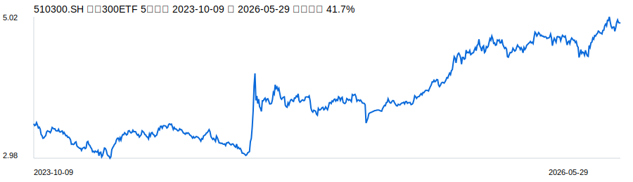
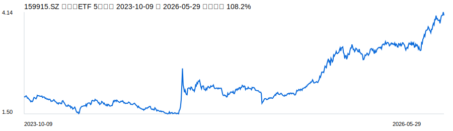
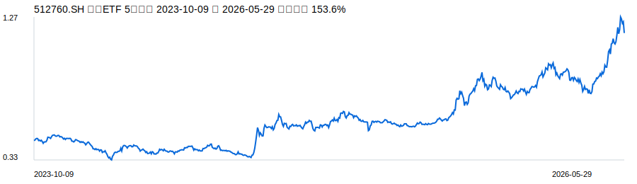
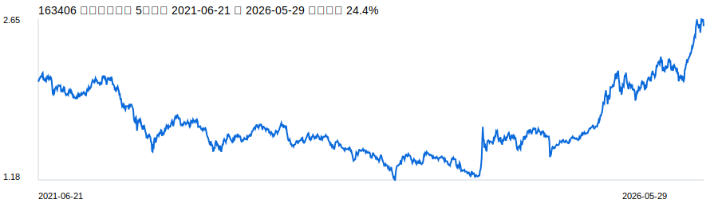
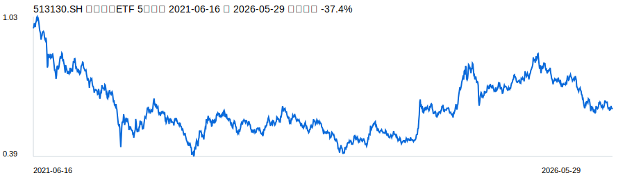
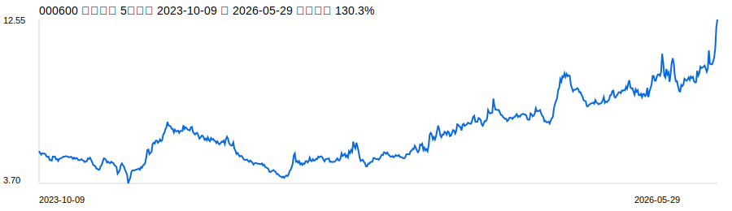
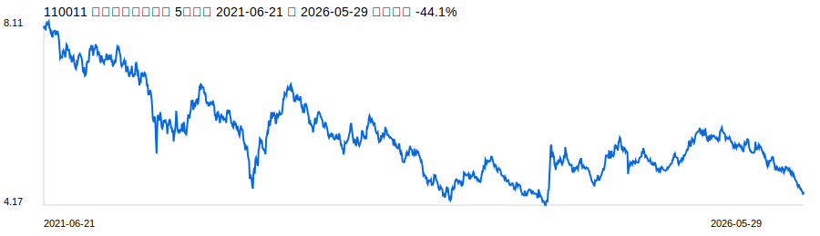
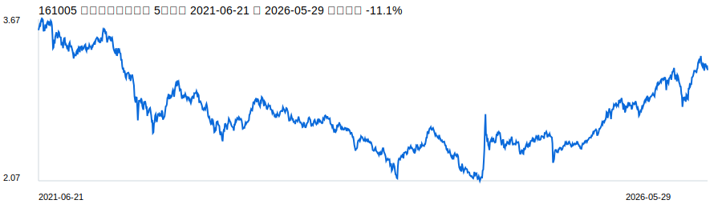
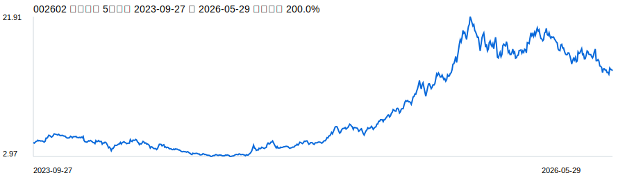
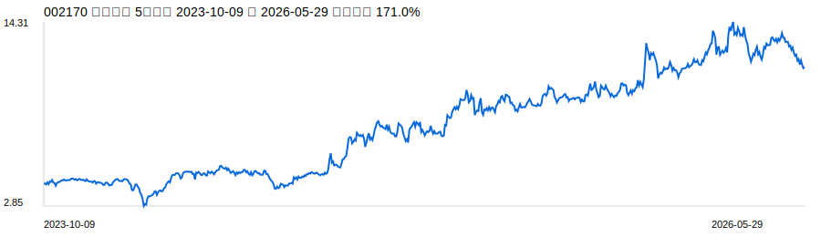

# 一键 A股/港股观察池

生成时间：2026-05-31T17:23:02
策略：`one-click-ah-watchlist`
约束：股票、ETF、基金每类不超过 5 支，合计不超过 10 支；按综合得分排序取 Top 10 以内。
用途：研究观察池，不构成投资建议。

## 打分策略与权重

### 股票评分

| 维度 | 权重 | 说明 |
| --- | ---: | --- |
| 质量价值 | 30 | 用于衡量股票的质量价值。 |
| 成长趋势 | 20 | 用于衡量股票的成长趋势。 |
| 现金流与资产负债 | 15 | 用于衡量股票的现金流与资产负债。 |
| 估值安全边际 | 15 | 用于衡量股票的估值安全边际。 |
| 排雷清洁度 | 10 | 用于衡量股票的排雷清洁度。 |
| 流动性与可跟踪性 | 5 | 用于衡量股票的流动性与可跟踪性。 |
| 交叉验证 | 5 | 用于衡量股票的交叉验证。 |

### ETF评分

| 维度 | 权重 | 说明 |
| --- | ---: | --- |
| 流动性与规模 | 25 | 用于衡量ETF的流动性与规模。 |
| 代表性与分散度 | 25 | 用于衡量ETF的代表性与分散度。 |
| 费用与跟踪便利 | 15 | 用于衡量ETF的费用与跟踪便利。 |
| 主题契合度 | 20 | 用于衡量ETF的主题契合度。 |
| 风险控制 | 15 | 用于衡量ETF的风险控制。 |

### 基金评分

| 维度 | 权重 | 说明 |
| --- | ---: | --- |
| 长期业绩与回撤 | 25 | 用于衡量主动基金的长期业绩与回撤。 |
| 基金经理与团队稳定 | 20 | 用于衡量主动基金的基金经理与团队稳定。 |
| 风格清晰度 | 20 | 用于衡量主动基金的风格清晰度。 |
| 持仓质量 | 20 | 用于衡量主动基金的持仓质量。 |
| 费率与规模适中 | 15 | 用于衡量主动基金的费率与规模适中。 |

## 最终观察池

| 排名 | 类别 | 代码 | 名称 | 方向 | 综合得分 | 入选理由 | 主要风险 |
| ---: | --- | --- | --- | --- | ---: | --- | --- |
| 1 | ETF | 510300.SH | 沪深300ETF | A股核心宽基 | 86.00 | 宽基核心资产暴露，适合做组合底仓观察。 | 大盘风格不占优时弹性不足。 |
| 2 | ETF | 159915.SZ | 创业板ETF | 成长宽基 | 82.00 | 覆盖成长、科技和医药权重，适合作为成长风格观察工具。 | 波动较高，受风险偏好影响大。 |
| 3 | ETF | 512760.SH | 芯片ETF | 半导体国产替代 | 80.00 | 映射芯片、设备、材料等方向，替代单一芯片股风险。 | 行业周期和估值波动大。 |
| 4 | 基金 | 163406 | 兴全合润混合 | 主动权益均衡 | 79.00 | 长期主动权益代表产品之一，适合作为主动管理风格观察样本。 | 基金经理、持仓和风格会变化，需读取最新季报确认。 |
| 5 | ETF | 513130.SH | 恒生科技ETF | 港股科技 | 78.00 | 覆盖港股互联网和科技平台，补充港股弹性。 | 港股流动性、汇率和监管预期波动。 |
| 6 | 股票 | 000600 | 建投能源 | 电力 | 77.33 | 独立综合分 77.33；PE 11.13，PB 1.81；雪球交叉验证：命中。 | 需核验一次性收益、现金流持续性、公告风险、行业景气高点和估值口径。 |
| 7 | 基金 | 110011 | 易方达优质精选系 | 质量成长 | 76.00 | 质量成长风格观察样本。 | 产品名称、经理和持仓需以最新基金公告为准。 |
| 8 | 基金 | 161005 | 富国天惠成长混合 | 长期成长 | 75.00 | 长期成长风格样本，适合观察主动成长基金。 | 风格和阶段性回撤需复核。 |
| 9 | 股票 | 002602 | 世纪华通 | 游戏Ⅱ | 73.99 | 独立综合分 73.99；PE 17.11，PB 3.37；雪球交叉验证：未命中。 | 需核验一次性收益、现金流持续性、公告风险、行业景气高点和估值口径。 |
| 10 | 股票 | 002170 | 芭田股份 | 农化制品 | 70.45 | 独立综合分 70.45；PE 10.99，PB 3.19；雪球交叉验证：未命中。 | 需核验一次性收益、现金流持续性、公告风险、行业景气高点和估值口径。 |

## 入选标的5年走势

### ETF 510300.SH 沪深300ETF

走势数据：`data\market\kline\ETF-510300SH-5y-daily.csv`

### ETF 159915.SZ 创业板ETF

走势数据：`data\market\kline\ETF-159915SZ-5y-daily.csv`

### ETF 512760.SH 芯片ETF

走势数据：`data\market\kline\ETF-512760SH-5y-daily.csv`

### 基金 163406 兴全合润混合

走势数据：`data\market\kline\基金-163406-5y-daily.csv`

### ETF 513130.SH 恒生科技ETF

走势数据：`data\market\kline\ETF-513130SH-5y-daily.csv`

### 股票 000600 建投能源

走势数据：`data\market\kline\股票-000600-5y-daily.csv`

### 基金 110011 易方达优质精选系

走势数据：`data\market\kline\基金-110011-5y-daily.csv`

### 基金 161005 富国天惠成长混合

走势数据：`data\market\kline\基金-161005-5y-daily.csv`

### 股票 002602 世纪华通

走势数据：`data\market\kline\股票-002602-5y-daily.csv`

### 股票 002170 芭田股份

走势数据：`data\market\kline\股票-002170-5y-daily.csv`

## 后续核验

1. 股票：复核最新年报、季报、公告、减持、监管问询、现金流持续性和一次性收益。
2. ETF：复核基金规模、成交额、跟踪误差、费率和成分股集中度。
3. 基金：复核最新季报、基金经理、持仓、换手率、回撤和风格漂移。
4. 每周更新价格和风险变化；每季度更新基本面和基金持仓。

独立股票筛选明细：`data\stocks\one-click-independent-stock-screen-2026-05-31.csv`
